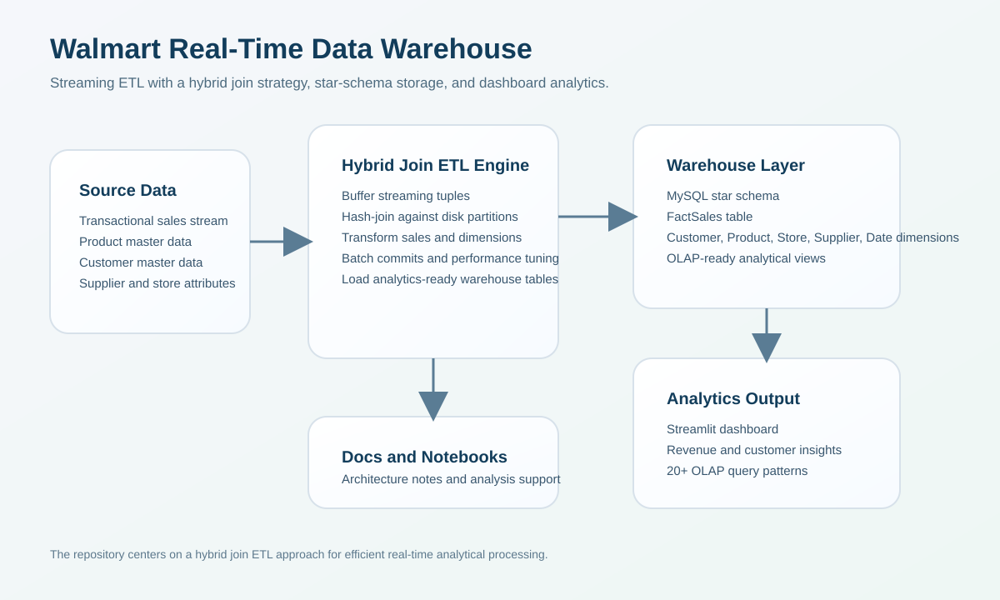
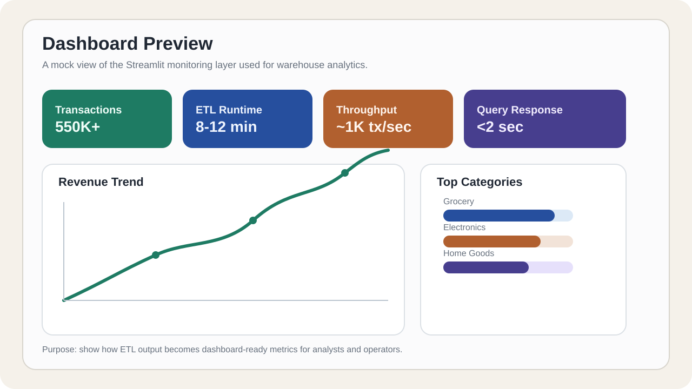
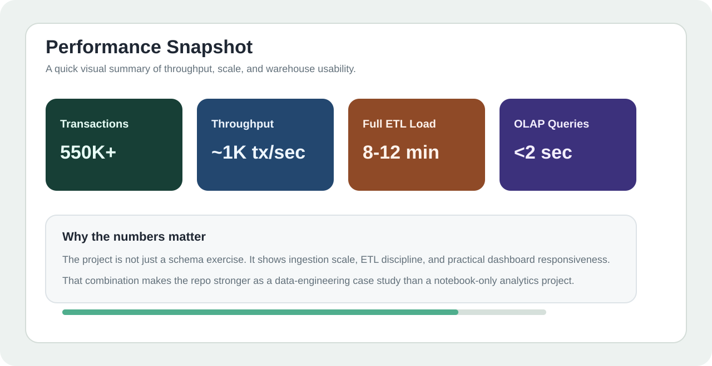

# Walmart Real-Time Data Warehouse with Hybrid Join


A production-style retail analytics project that ingests high-volume transactions, joins them efficiently with master data using a Hybrid Join strategy, and serves warehouse metrics through OLAP-style reporting and a Streamlit dashboard.



## Demo Video

- [Walmart Real-Time Data Warehouse Demo](https://youtu.be/tNXZprHzTZE?si=Bs3EmtmVa2eURvFX)

## Quick Proof Links

- [Architecture notes](docs/ARCHITECTURE.md)
- [ETL pipeline](src/etl/hybrid_join_etl.py)
- [Dashboard app](src/dashboard/streamlit_app.py)
- [Schema setup](sql/01_create_schema.sql)
- [Views setup](sql/02_create_views.sql)

## Executive Summary

- Problem: large retail systems need fresh analytical data without expensive row-by-row joins.
- Solution: stream transactions, probe disk-resident master data through a Hybrid Join workflow, and load a star-schema warehouse for OLAP analysis.
- Proof: runnable ETL code, MySQL schema, Streamlit dashboard, architecture documentation, and demo video.
- Outcome: fast warehouse loading, dashboard-ready metrics, and a project structure closer to real data-engineering work than a notebook-only exercise.

## What Problem This Solves

Retail organizations generate high transaction volumes, but their analytical systems still need:

- reliable product and customer enrichment
- fast warehouse loading
- dimensional modeling for reporting
- dashboard-friendly aggregates
- query performance that stays usable as volume grows

Naive enrichment approaches can become slow because each incoming transaction may require repeated master-data lookups. This project addresses that by using a Hybrid Join design to reduce unnecessary disk access while still loading a structured warehouse.

## Why This Repo Is Strong

This repository demonstrates a practical real-time analytics workflow:

- transaction ingestion and buffering
- Hybrid Join processing for stream-to-disk enrichment
- MySQL star-schema warehouse design
- ETL batching and commit optimization
- Streamlit-based analytical monitoring
- OLAP-style query patterns for reporting and exploration

## Visual Proof

### Dashboard preview



### Performance snapshot



## Performance Snapshot

- Processing speed: about 1,000 transactions per second
- Data volume: 550,000+ transactions
- ETL runtime: about 8 to 12 minutes for a full load
- Query response: under 2 seconds for many OLAP-style queries

## Tech Stack

| Layer | Tools |
| --- | --- |
| Database | MySQL 8.0+ |
| Backend | Python 3.11 |
| ETL | Custom Hybrid Join implementation |
| Analytics UI | Streamlit |
| Visualization | Plotly |
| Data libraries | pandas, mysql-connector-python, SQLAlchemy |

## Repository Structure

```text
walmart-real-time-data-warehouse/
|-- src/
|   |-- etl/hybrid_join_etl.py
|   `-- dashboard/streamlit_app.py
|-- sql/
|   |-- 01_create_schema.sql
|   `-- 02_create_views.sql
|-- data/
|-- notebooks/
|-- docs/
`-- scripts/
```

## Architecture Summary

The overall workflow is:

1. ingest transactional and master datasets
2. buffer streaming tuples in memory
3. join them efficiently against disk-resident partitions using a hybrid strategy
4. load transformed data into a star-schema warehouse
5. serve analysis through OLAP queries and a Streamlit dashboard

For deeper detail, see [docs/ARCHITECTURE.md](docs/ARCHITECTURE.md).

## Hybrid Join Idea

The Hybrid Join approach in this project is built around:

1. buffering stream tuples in memory
2. partitioning master data into disk blocks
3. loading a partition and joining it against buffered tuples
4. amortizing disk I/O across many matches

Why it helps:

- fewer disk reads compared with naive repeated lookups
- fast hash-based matching
- better fit for high-volume analytical ingestion

## Dashboard and Analytics

The project supports:

- real-time transaction monitoring
- revenue visibility
- customer and product insights
- temporal and category-based analysis
- store and supplier performance tracking
- OLAP-style analytical exploration

## Example Analytical Query

```sql
SELECT p.Product_ID, SUM(fs.Revenue) AS TotalRevenue
FROM FactSales fs
JOIN DimProduct p ON fs.ProductKey = p.ProductKey
GROUP BY p.Product_ID
ORDER BY TotalRevenue DESC
LIMIT 5;
```

## Quick Start

### Prerequisites

- MySQL Server 8.0+
- Python 3.11+
- Git

### Installation

```bash
git clone https://github.com/abubakarshahid16/walmart-real-time-data-warehouse.git
cd walmart-real-time-data-warehouse

pip install -r requirements.txt

mysql -u root -p < sql/01_create_schema.sql
mysql -u root -p BlackDW < sql/02_create_views.sql
```

### Configuration

Update database credentials in:

- `src/etl/hybrid_join_etl.py`
- `src/dashboard/streamlit_app.py`

Example configuration block:

```python
DB_CONFIG = {
    "host": "localhost",
    "user": "root",
    "password": "your_password",
    "database": "BlackDW",
}
```

### Run ETL

```bash
python src/etl/hybrid_join_etl.py
```

### Launch Dashboard

```bash
streamlit run src/dashboard/streamlit_app.py
```

Dashboard URL:

```text
http://localhost:8501
```

## Implementation Positioning

This repository demonstrates the data model, ETL logic, Hybrid Join strategy, and dashboard layer required for a retail analytics warehouse.

In a more production-oriented deployment, the same architecture could be extended with:

- Kafka or another event stream for live ingestion
- Airflow or Dagster orchestration
- stronger observability and retry handling
- containerized deployment for ETL and dashboard services
- warehouse migration toward distributed storage or compute as scale grows

## Why This Project Matters

This repository is a strong portfolio project because it demonstrates:

- data warehouse design
- ETL pipeline implementation
- performance-aware data processing
- analytical schema design
- dashboard-based reporting
- practical data-engineering thinking beyond basic notebooks

## Author

Abubakar Shahid  
GitHub: <https://github.com/abubakarshahid16>  
LinkedIn: <https://www.linkedin.com/in/abubakar-shahid-90a365220/>

## License

This project is licensed under the MIT License.
