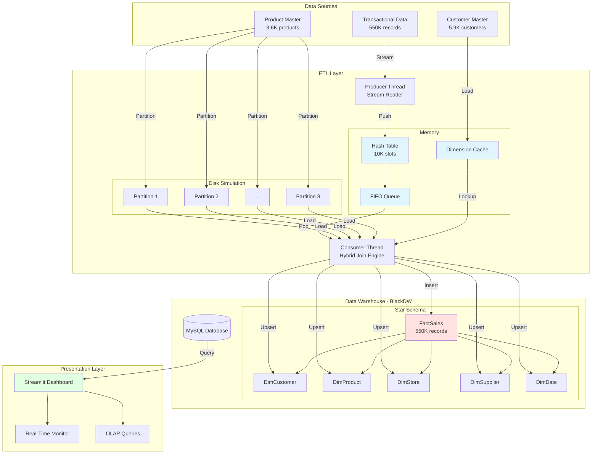
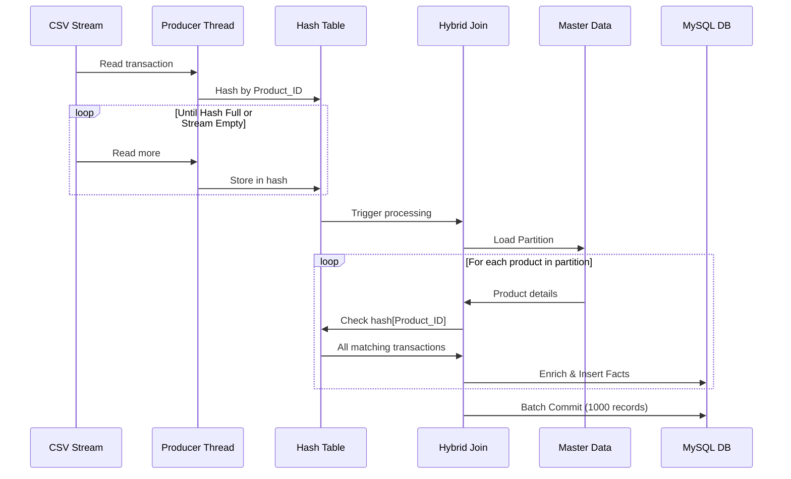
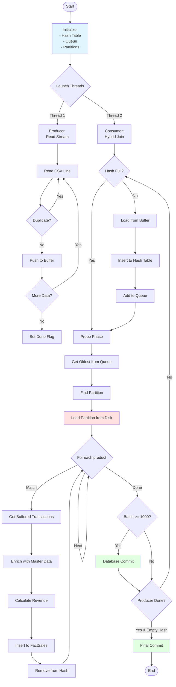

# System Architecture

## Overview

This system implements a real-time data warehouse using the **Hybrid Join algorithm** for efficient ETL processing of streaming sales transactions.

## Architecture Diagram

## Data Flow

## Hybrid Join Algorithm

## Component Details

### 1. ETL Layer
- **Producer Thread**: Reads CSV stream, deduplicates, pushes to buffer
- **Consumer Thread**: Implements Hybrid Join algorithm
- **Hash Table**: 10,000 slots for buffering transactions
- **FIFO Queue**: Ensures fair, first-in-first-out processing
- **Dimension Cache**: RAM-based lookup for foreign keys

### 2. Data Warehouse
- **Schema**: Star schema with 5 dimensions, 1 fact
- **Indexing**: All foreign keys indexed
- **Optimization**: Batch commits, cascading updates

### 3. Dashboard
- **Real-Time Tab**: Live metrics with auto-refresh
- **OLAP Tab**: 20 pre-built analytical queries
- **Visualization**: Plotly charts (line, bar, area)

## Performance Optimizations

| Optimization | Impact |
|--------------|--------|
| **Partitioning** | 99.6% reduction in disk reads |
| **RAM Caching** | 2.75M queries avoided |
| **Batch Commits** | 99.9% reduction in disk writes |
| **Hash Table** | O(1) lookup time |
| **FIFO Queue** | Fair processing, no starvation |

## Scalability

- **Horizontal**: Partition master data across multiple disks
- **Vertical**: Increase hash table size for larger streams
- **Parallel**: Multiple consumer threads per partition
- **Distributed**: Kafka for true streaming, Spark for processing
